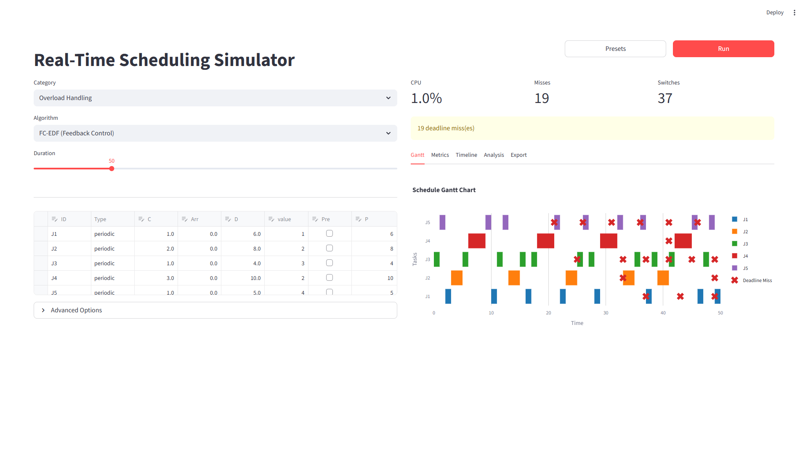
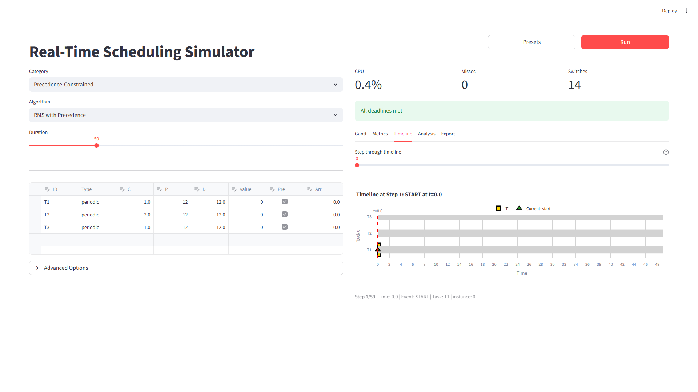
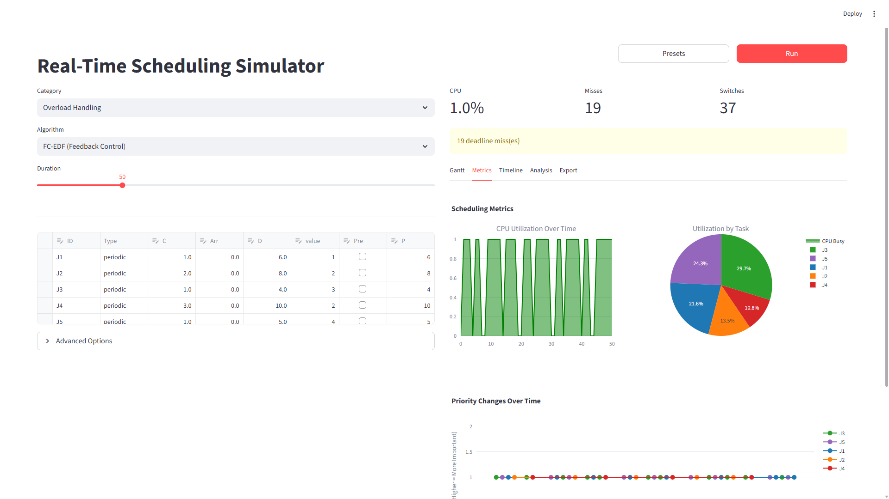

# Real-Time Scheduling Simulator

## About

```text
███████╗ ██████╗██╗  ██╗███████╗██████╗ ██╗   ██╗██╗     ███████╗██████╗
██╔════╝██╔════╝██║  ██║██╔════╝██╔══██╗██║   ██║██║     ██╔════╝██╔══██╗
███████╗██║     ███████║█████╗  ██║  ██║██║   ██║██║     █████╗  ██████╔╝
╚════██║██║     ██╔══██║██╔══╝  ██║  ██║██║   ██║██║     ██╔══╝  ██╔══██╗
███████║╚██████╗██║  ██║███████╗██████╔╝╚██████╔╝███████╗███████╗██║  ██║
╚══════╝ ╚═════╝╚═╝  ╚═╝╚══════╝╚═════╝  ╚═════╝ ╚══════╝╚══════╝╚═╝  ╚═╝
```

This project is developed and maintained by Shahab Afshar.

[](https://orcid.org/0009-0000-3682-0471)
[](https://www.linkedin.com/in/shahabafshar)
[](https://github.com/shahabafshar/Scheduler)
[](https://shahabafshar-scheduler.streamlit.app)

**Professor:** [Dr. G. Manimaran](https://www.engineering.iastate.edu/people/profile/gmani/) [](https://scholar.google.com/citations?user=vkOTo_EAAAAJ)

**Course:** CPR E 458/558: Real-Time Systems
**Department:** Electrical and Computer Engineering (ECPE)
**University:** Iowa State University


**Real-Time Scheduling Simulator** is a comprehensive discrete-event simulator for analyzing and visualizing real-time task scheduling algorithms. It implements server-based algorithms (Polling, Deferrable, Sporadic, Background) for mixed periodic-aperiodic workloads, providing interactive Gantt chart visualizations and schedulability analysis.

## Visual Abstract


## Features

- **13+ Scheduling Algorithms**: RMS, EDF, DMS, LLF, Polling Server, Deferrable Server, Sporadic Server, Background Scheduler, and more
- **Interactive Gantt Charts**: Visualize task execution with color-coded bars, deadline markers, and server capacity events
- **Schedulability Analysis**: Utilization tests for RMS, EDF, DMS with pass/fail indicators
- **Parameter Exploration**: Adjust server capacity ($C_s$) and period ($P_s$) via sliders
- **21 Preset Configurations**: Curated task sets from literature examples
- **Performance Metrics**: CPU utilization, context switches, deadline misses, response times

## Prerequisites

- Python 3.10 or newer
- pip (Python package manager)

## Installation

1. Clone this repository:

```bash
git clone https://github.com/shahabafshar/Scheduler.git
cd Scheduler
```

1. Install dependencies:

```bash
pip install -r scheduler/requirements.txt
```

## Usage

Start the interactive web application:

```bash
streamlit run scheduler/app.py
```

The application will open in your default web browser at `http://localhost:8501`

### Quick Start

1. **Select Algorithm**: Choose from Basic, Server-Based, Precedence, or Overload categories
2. **Configure Tasks**: Edit task parameters in the data grid or load a preset
3. **Run Simulation**: Click "Run Simulation" to generate results
4. **Analyze Results**: View Gantt charts, metrics, and schedulability analysis

## Project Structure

```text
scheduler/
├── app.py                  # Streamlit web UI
├── configs.py              # Preset configurations
├── core/                   # Core scheduling logic
│   ├── task.py             # Data models
│   ├── scheduler_base.py   # Base scheduler class
│   ├── algorithms/         # Scheduling algorithms
│   │   ├── rms.py          # Rate Monotonic
│   │   ├── edf.py          # Earliest Deadline First
│   │   ├── dms.py          # Deadline Monotonic
│   │   ├── llf.py          # Least Laxity First
│   │   └── combined.py     # Server-based algorithms
│   ├── analysis/           # Schedulability tests
│   └── protocols/          # Resource protocols (PIP/PCP)
├── visualization/          # Plotting components
│   ├── gantt.py            # Gantt chart generation
│   └── metrics_dashboard.py
└── requirements.txt        # Python dependencies
```

## Supported Algorithms

| Category | Algorithms |
|----------|------------|
| **Basic** | RMS, EDF, DMS, LLF |
| **Server-Based** | Polling Server, Deferrable Server, Sporadic Server, Background Scheduler |
| **Precedence** | RMS/EDF/DMS with task dependencies |
| **Overload** | Imprecise Computation, HVDF, (m,k)-firm |

## Screenshots

### Precedence-Constrained Scheduling



Task dependency visualization showing precedence constraints between tasks.

### Service Level Analysis



Service level analysis showing task completion rates and system performance under overload conditions.

## References

- Liu & Layland (1973) - Rate Monotonic Scheduling
- Sprunt, Sha & Lehoczky (1989) - Sporadic Server
- Strosnider, Lehoczky & Sha (1995) - Deferrable Server

## License

MIT License
