# Slide 1: Title

## Real-Time Scheduling Simulator
### Server-Based Algorithms for Mixed Periodic-Aperiodic Workloads

**Shahab Afshar**

CPR E 458/558: Real-Time Systems
Fall 2025

Department of Electrical and Computer Engineering
Iowa State University

GitHub: <https://github.com/shahabafshar/Scheduler>

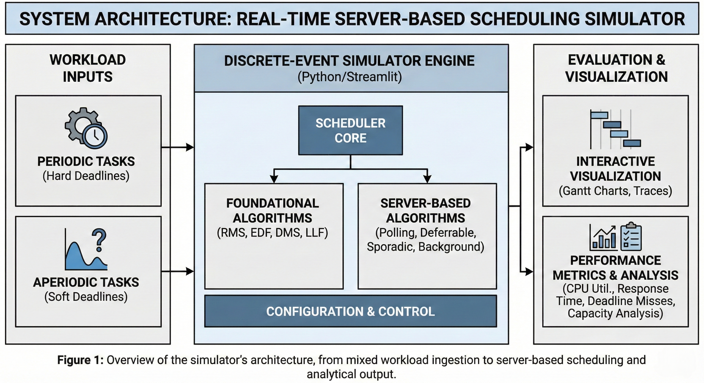

<!-- SPEAKER NOTES:
- Introduce yourself and the project title
- Mention this is for CPR E 458/558 Real-Time Systems course
- Estimated time: 30 seconds
-->

---

# Slide 2: Problem Statement

## The Challenge

**Real-time systems must satisfy timing constraints** in addition to functional correctness.

### Real-World Example: Automotive ECU

An engine control unit must handle:

- **Periodic tasks:** Engine control (10ms), ABS monitoring (5ms), fuel injection (20ms)
- **Aperiodic tasks:** Driver button presses, diagnostic requests, error handling

*Challenge: How to guarantee both periodic AND aperiodic tasks meet their deadlines?*

### The Gap

- **Theoretical analysis** provides utilization bounds but doesn't show temporal behavior
- **Manual schedule construction** is tedious and error-prone
- **RTOS testing** requires significant development effort
- Engineers need to **explore algorithm behavior** before committing to implementation

### Research Questions

| ID | Question |
|----|----------|
| **RQ1** | Can a discrete-event simulator faithfully implement server capacity management policies? |
| **RQ2** | Does interactive visualization help users understand algorithm differences? |
| **RQ3** | Can parameter exploration (varying $C_s$/$P_s$) reveal optimal configurations? |

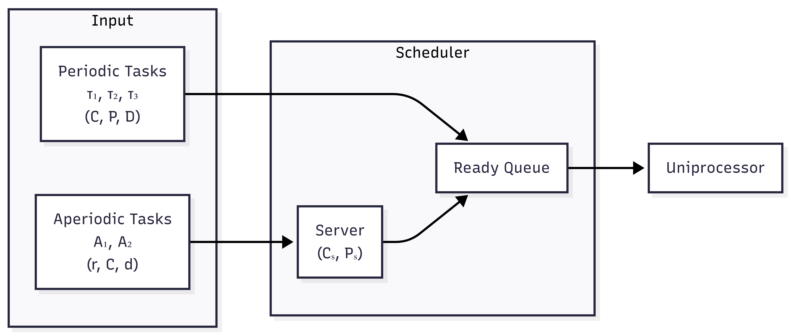

<!-- SPEAKER NOTES:
- Start with automotive example - relatable to audience
- Emphasize the GAP: formulas don't show behavior over time
- Key point: Engineers need to SEE what happens before committing
- Introduce the three research questions - these guide the entire project
- Estimated time: 2 minutes
-->

---

# Slide 3: Solution Overview (1/2)

## Four Server-Based Scheduling Algorithms

| Algorithm | Capacity Management | Response Time |
|-----------|-------------------|---------------|
| **Polling Server** | Lost if no aperiodic tasks | Moderate |
| **Deferrable Server** | Preserved until period end | Good |
| **Sporadic Server** | Dynamic replenishment at $t+P_s$ | Best |
| **Background Scheduler** | Runs during idle only | Worst |

### Key Differentiator: Capacity Management Policy

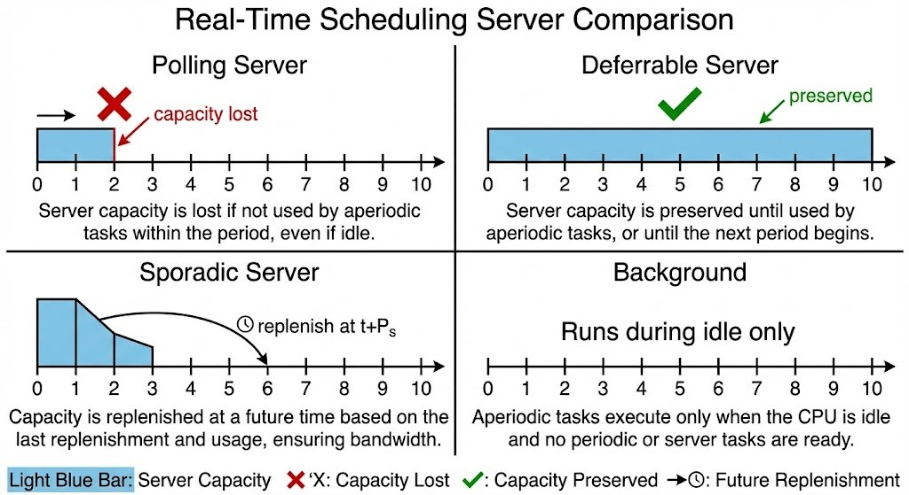

Sources: Sprunt et al. (1989), Strosnider et al. (1995)

<!-- SPEAKER NOTES:
- Walk through each server type briefly
- KEY DIFFERENTIATOR: What happens when server has priority but no aperiodic work?
  - Polling: loses capacity (wasteful)
  - Deferrable: keeps it (but affects periodic schedulability)
  - Sporadic: schedules replenishment (best of both)
  - Background: only runs when nothing else to do
- Point to the figure showing capacity behavior
- Estimated time: 2 minutes
-->

---

# Slide 4: Solution Overview (2/2)

## Interactive Simulation Platform

### Core Features

1. **Discrete-event simulation** with exact algorithm implementation
2. **Interactive Gantt charts** showing capacity events
3. **Parameter exploration** via sliders ($C_s$, $P_s$)
4. **21 preset configurations** for quick experimentation
5. **Schedulability analysis** (RMS, EDF, DMS bounds)

### Supported Algorithms

- **Basic:** RMS, EDF, DMS, LLF -- Liu & Layland (1973)
- **Server-Based:** Polling, Deferrable, Sporadic, Background
- **Advanced:** Precedence-constrained, Overload handling, Value-based (HVDF)

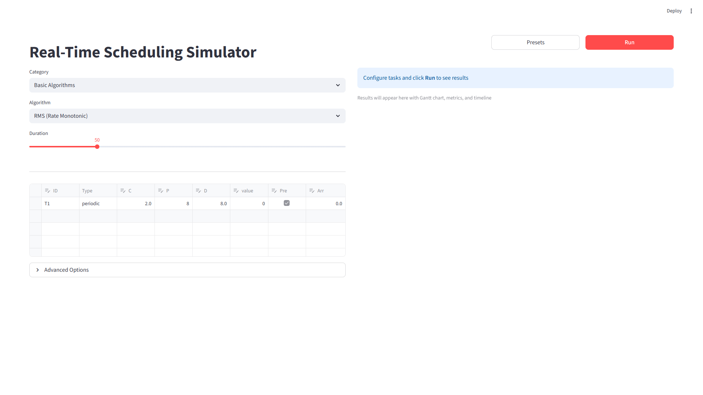

<!-- SPEAKER NOTES:
- Show the screenshot - this is what users interact with
- Highlight: configuration on left, results on right
- Mention 21 presets for quick experimentation
- 13+ algorithms total - focus is on server-based for this project
- Estimated time: 1.5 minutes
-->

---

# Slide 5: Implementation Details (1/2)

## Software Architecture

### Layered Design with Clear Separation of Concerns

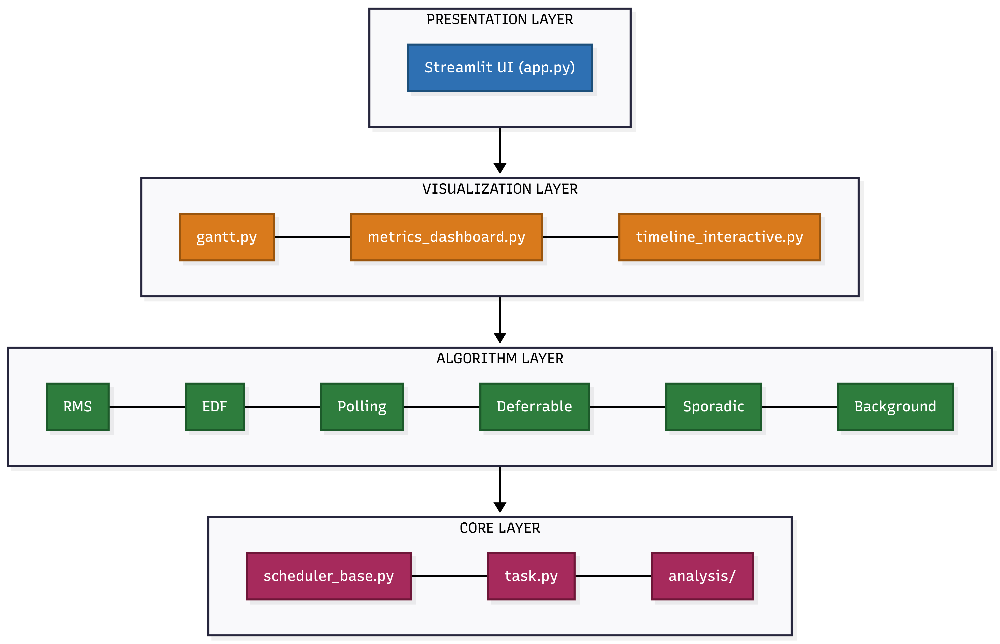

### Technology Stack

| Component | Technology | Purpose |
|-----------|------------|---------|
| Core Logic | Python 3.10+ | Simulation engine |
| Web UI | Streamlit | Interactive dashboard |
| Visualization | Plotly | Gantt charts, metrics |
| Data Handling | Pandas | Task tables, export |

<!-- SPEAKER NOTES:
- Three-layer architecture ensures clean separation
- Core layer: pure Python, no UI dependencies - easy to test
- Visualization layer: Plotly for interactive charts
- UI layer: Streamlit for rapid web development
- This architecture makes it easy to add new algorithms
- Estimated time: 1.5 minutes
-->

---

# Slide 6: Implementation Details (2/2)

## Design Pattern: Template Method

**Key Insight:** All schedulers share the same simulation loop; only priority assignment differs.

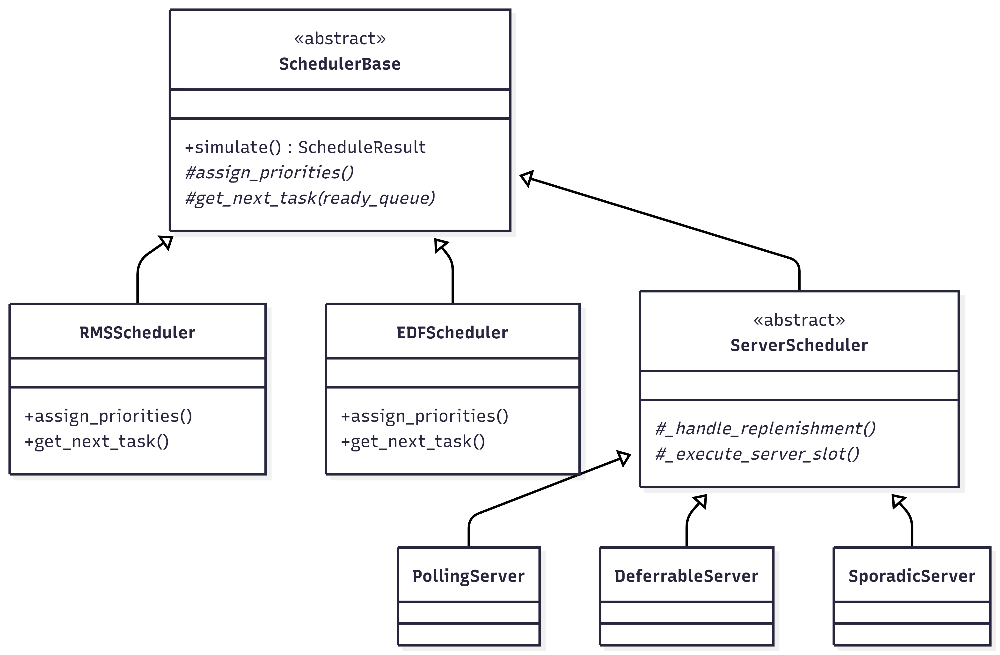

### Server-Specific Hooks

```python
class ServerSchedulerBase(SchedulerBase):
    def _handle_replenishment(self, t):
        """When/how to replenish capacity"""

    def _execute_server_slot(self, t):
        """What to do when server has priority"""
```

### Capacity Management Difference

| Server | `_execute_server_slot()` when no aperiodic tasks |
|--------|--------------------------------------------------|
| Polling | `self.server_remaining = 0` (capacity lost) |
| Deferrable | `return False` (capacity preserved) |
| Sporadic | Schedule replenishment at `t + P_s` |

<!-- SPEAKER NOTES:
- Template Method pattern is KEY architectural decision
- Base class handles: time advancement, ready queue, preemption
- Subclasses only override: priority assignment, task selection
- Show the code snippet: just 2 methods to implement
- Table shows HOW servers differ in just one line of code each
- Estimated time: 2 minutes
-->

---

# Slide 7: Testing & Evaluation Results (1/2)

## Correctness Validation (RQ1)

### Server Behavior Verification

| Server Type | Expected Behavior | Verified |
|-------------|-------------------|----------|
| Polling | `capacity_lost` events when idle | Yes |
| Deferrable | `deferred` events preserve capacity | Yes |
| Sporadic | `replenish` events at $t + P_s$ | Yes |
| Background | Runs only during CPU idle | Yes |

### Gantt Chart Evidence

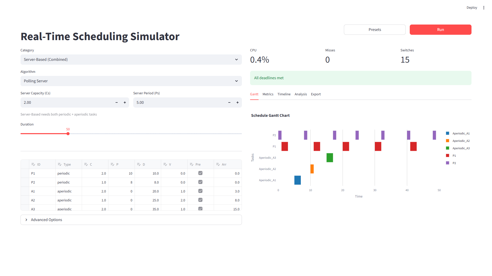

*Polling Server: Gantt chart shows task execution and server events*

<!-- SPEAKER NOTES:
- RQ1 answer: YES, we can faithfully implement server algorithms
- How verified? Look for expected EVENTS in the timeline
- Point to Gantt chart: show where capacity_lost would appear
- Each server type produces characteristic event patterns
- This is BEHAVIORAL verification, not just output checking
- Estimated time: 1.5 minutes
-->

---

# Slide 8: Testing & Evaluation Results (2/2)

## Parameter Sensitivity Results (RQ3)

### Server Capacity Effect on Aperiodic Response Time

**Workload:** P1(C=1,P=10), P2(C=1,P=15), A1(C=8, arrives t=0)

| $C_s$ | $P_s$ | A1 Response Time | Replenishments |
|-------|-------|------------------:|---------------:|
| 2 | 5 | 17 | 4 |
| 4 | 5 | 9 | 2 |
| 8 | 5 | 8 | 1 |

**Finding:** Larger $C_s$ reduces aperiodic response time by reducing replenishment cycles.

### Visualization Effectiveness (RQ2)

- Color-coded task bars distinguish periodic vs. aperiodic
- Red triangles mark deadlines
- Server events (`replenish`, `deferred`, `capacity_lost`) labeled on timeline
- Hover tooltips show remaining computation time


<!-- SPEAKER NOTES:
- RQ3: Parameter exploration WORKS - table shows clear trend
- Doubling capacity (2->4->8) dramatically reduces response time
- This is insight you can't get from formulas alone
- RQ2: Point to screenshot features - colors, triangles, labels
- Users can VISUALLY compare algorithms side by side
- Estimated time: 2 minutes
-->

---

# Slide 9: Conclusions

## Research Question Answers

### RQ1: Faithful Implementation -- Yes

Simulator correctly implements capacity management as verified by observing expected events (`capacity_lost`, `deferred`, `replenish`).

### RQ2: Visualization Effectiveness -- Yes

Gantt charts clearly show when capacity is lost vs. preserved. Users can visually compare algorithm behavior.

### RQ3: Parameter Exploration -- Yes

Varying $C_s$ from 2 to 8 shows response time reduction (17 to 8 time units), enabling optimal configuration discovery.

## Key Contributions

1. **Open-source simulator** with 4 server algorithms
2. **Interactive Gantt charts** displaying capacity events
3. **21 preset configurations** from literature examples
4. **Parameter exploration** via sliders
5. **Schedulability analysis** (RMS, EDF, DMS)

<!-- SPEAKER NOTES:
- Summarize: All three RQs answered positively
- Emphasize the 5 key contributions
- Open-source: available for others to use and extend
- 21 presets from actual course materials - verified correctness
- Transition: "But no project is perfect..."
- Estimated time: 1.5 minutes
-->

---

# Slide 10: Limitations & Future Work

## Current Limitations

- **Single-processor only:** Multi-core scheduling not yet supported
- **No resource contention:** Priority Inheritance/Ceiling protocols implemented but not integrated
- **Limited validation:** User study needed for formal RQ2 assessment
- **Simulation scope:** Does not model I/O delays, cache effects, or interrupt latency

## Future Directions

- **Multi-core extension:** Partitioned and global scheduling algorithms
- **Resource protocol integration:** PIP/PCP for shared resource scenarios
- **RTOS trace import:** Compare simulation with FreeRTOS/Zephyr execution traces
- **Formal verification:** Model checking for schedulability guarantees

<!-- SPEAKER NOTES:
- Be honest about limitations - shows academic rigor
- Single-processor is biggest limitation for modern systems
- Resource protocols ARE implemented, just not integrated yet
- Future work: multi-core is natural next step
- RTOS trace import would enable real-world validation
- Estimated time: 1 minute
-->

---

# Slide 11: Learning Achieved

## Technical Skills Developed

### Real-Time Systems Concepts
- Deep understanding of server-based scheduling (Polling, Deferrable, Sporadic)
- RMS utilization bounds and schedulability analysis
- Capacity management policies and their trade-offs

### Software Engineering
- **Template Method pattern** for extensible scheduler architecture
- **Strategy pattern** for composable priority policies
- Event-driven simulation design

### Tools & Technologies
- Python for discrete-event simulation
- Streamlit for rapid web UI development
- Plotly for interactive visualizations

## Lessons Learned

1. **Simulation reveals behavior** that formulas cannot show
2. **Visualization is essential** for understanding scheduling dynamics
3. **Parameter exploration** enables informed design decisions
4. **Modular architecture** simplifies adding new algorithms

<!-- SPEAKER NOTES:
- Personal reflection slide - what YOU learned
- Three categories: RT concepts, software engineering, tools
- Highlight Template Method - this is a transferable skill
- Four lessons learned - these apply beyond this project
- End with: "Simulation reveals what formulas cannot show"
- Invite questions
- Estimated time: 1.5 minutes
-->

---

# Appendix: Additional Screenshots

## Server Algorithm Comparisons

### Deferrable Server
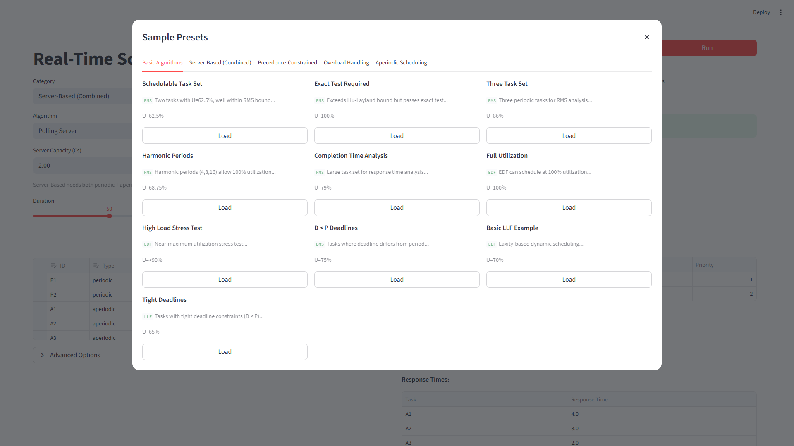

### Server Analysis Dashboard

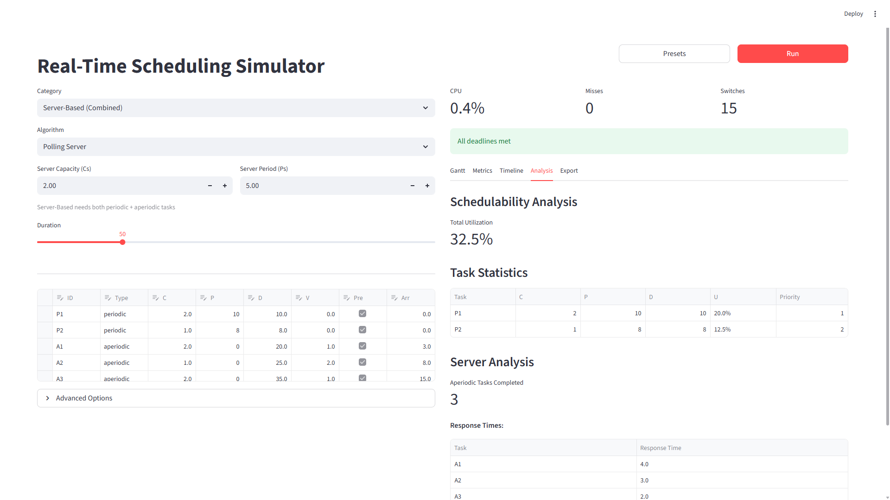

### Background Scheduler


---

## Basic Algorithm Results

### RMS Gantt Chart
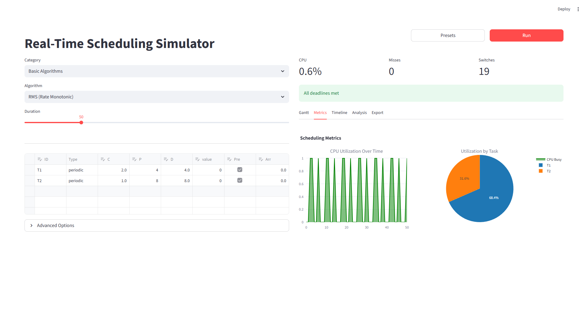

### EDF Priority Timeline
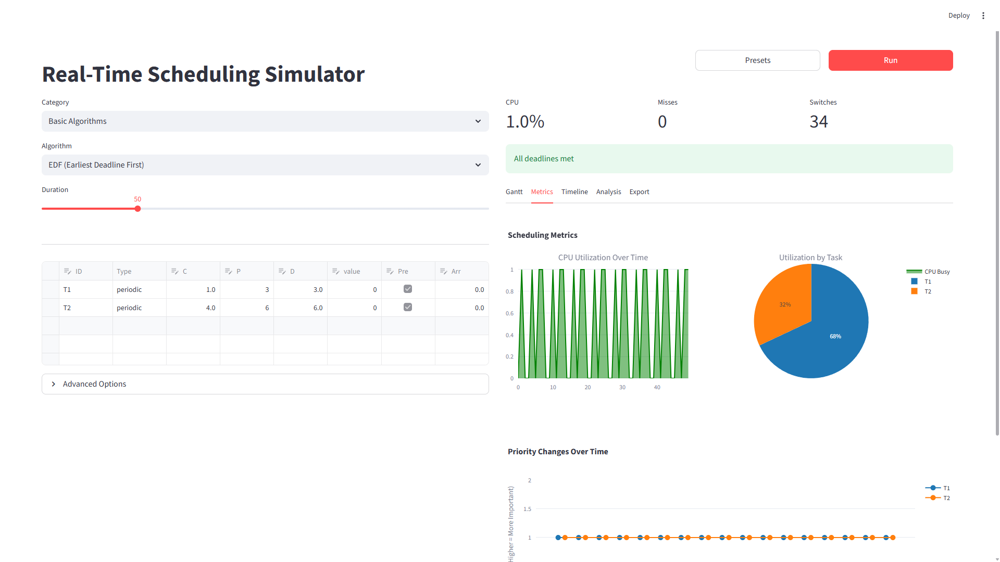

---

## UI Overview

### Server Configuration Panel

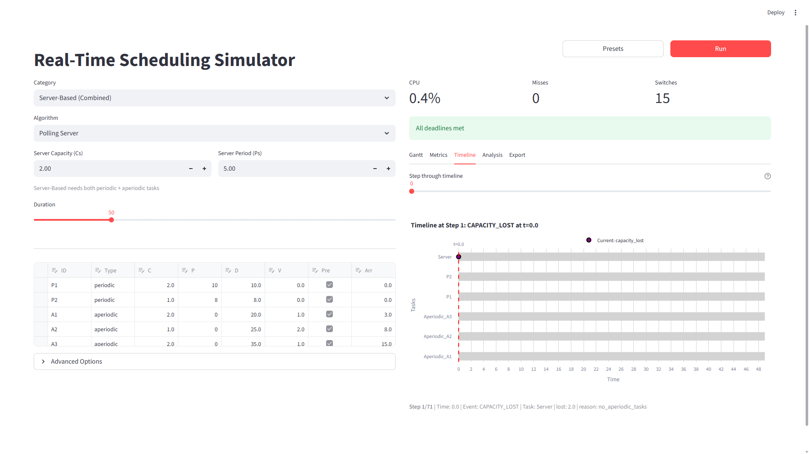

### Preset System
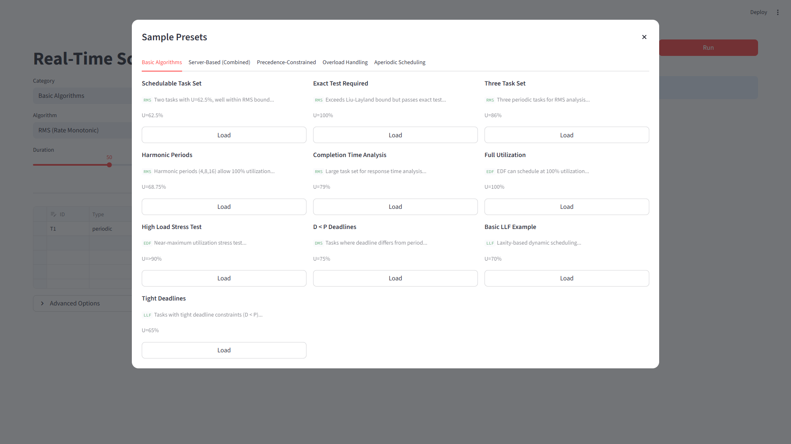

---

# References

[1] B. Sprunt, L. Sha, and J. Lehoczky, "Aperiodic task scheduling for Hard-Real-Time systems," *Real-Time Syst*, vol. 1, no. 1, pp. 27-60, June 1989, doi: 10.1007/BF02341920.

[2] J. K. Strosnider, J. P. Lehoczky, and L. Sha, "The deferrable server algorithm for enhanced aperiodic responsiveness in hard real-time environments," *IEEE Transactions on Computers*, vol. 44, no. 1, pp. 73-91, 1995, doi: 10.1109/12.368008.

[3] M. Spuri and G. Buttazzo, "Scheduling aperiodic tasks in dynamic priority systems," *Real-Time Systems*, vol. 10, no. 2, pp. 179-210, Mar. 1996, doi: 10.1007/BF00360340.

[4] C. L. Liu and J. W. Layland, "Scheduling Algorithms for Multiprogramming in a Hard-Real-Time Environment," *J. ACM*, vol. 20, no. 1, pp. 46-61, Jan. 1973, doi: 10.1145/321738.321743.

---

*End of Presentation*
